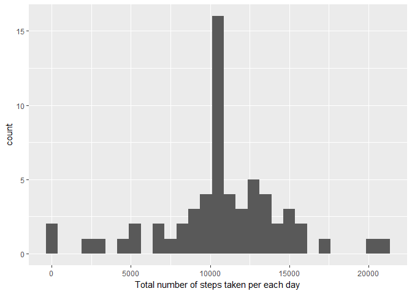

# jan13.Rmd
Rajesh  
January 13, 2017  


getting the data and loading it into R


```r
if(!file.exists("data")){dir.create("data")}
fileurl <- "https://d396qusza40orc.cloudfront.net/repdata%2Fdata%2Factivity.zip"
download.file(fileurl,destfile = "./data.zip",method="auto")
unzip(zipfile = "./data.zip")
data1 <- read.csv("./activity.csv",header = T,colClasses = c("integer", "character", "integer"),na.strings="NA")
library(markdown)
```


```r
library(lubridate)
```

```
## 
## Attaching package: 'lubridate'
```

```
## The following object is masked from 'package:base':
## 
##     date
```

```r
data1$date <- ymd(data1$date)
dim(data1)
```

```
## [1] 17568     3
```

```r
names(data1)
```

```
## [1] "steps"    "date"     "interval"
```

```r
head(data1)
```

```
##   steps       date interval
## 1    NA 2012-10-01        0
## 2    NA 2012-10-01        5
## 3    NA 2012-10-01       10
## 4    NA 2012-10-01       15
## 5    NA 2012-10-01       20
## 6    NA 2012-10-01       25
```


## Including Plots

### plot for 'Histogram of the total number of steps taken each day'

```r
library(dplyr)
```

```
## 
## Attaching package: 'dplyr'
```

```
## The following objects are masked from 'package:lubridate':
## 
##     intersect, setdiff, union
```

```
## The following objects are masked from 'package:stats':
## 
##     filter, lag
```

```
## The following objects are masked from 'package:base':
## 
##     intersect, setdiff, setequal, union
```

```r
everydaysteps <- data1 %>%
  filter(!is.na(steps)) %>%
  group_by(date) %>%
  summarize(steps = sum(steps)) %>%
  print
```

```
## # A tibble: 53 × 2
##          date steps
##        <date> <int>
## 1  2012-10-02   126
## 2  2012-10-03 11352
## 3  2012-10-04 12116
## 4  2012-10-05 13294
## 5  2012-10-06 15420
## 6  2012-10-07 11015
## 7  2012-10-09 12811
## 8  2012-10-10  9900
## 9  2012-10-11 10304
## 10 2012-10-12 17382
## # ... with 43 more rows
```

```r
library(ggplot2)
ggplot(everydaysteps, aes(x = steps)) +
  geom_histogram(fill = "firebrick", binwidth = 1000) +
  labs(title = "Histogram of Steps per day", x = "Steps per day", y = "Frequency")
```

<!-- -->

###Mean and median number of steps taken each day

```r
mean(everydaysteps$steps, na.rm=TRUE)
```

```
## [1] 10766.19
```

```r
median(everydaysteps$steps, na.rm=TRUE)
```

```
## [1] 10765
```

###Time series plot of the average number of steps taken
find the average number of steps for each 5 minute

```r
intervalsteps <- aggregate(steps ~ interval, data1,na.rm=T, mean)
names(intervalsteps)
```

```
## [1] "interval" "steps"
```

```r
names(intervalsteps)[2]
```

```
## [1] "steps"
```

```r
names(intervalsteps)[2] <- "average_steps"##changing the column name
g <- ggplot(intervalsteps,aes(interval,average_steps))
g+geom_line(col = "steelblue")+labs(x= "5-minute interval")+labs(y = "average number of steps taken")
```

<!-- -->
###The 5-minute interval that, on average, contains the maximum number of steps

```r
intervalsteps[which.max(intervalsteps$average_steps),]
```

```
##     interval average_steps
## 104      835      206.1698
```
###Code to describe and show a strategy for imputing missing dat
to know how many missing values

```r
missing <- is.na(data1$steps)
table(missing)
```

```
## missing
## FALSE  TRUE 
## 15264  2304
```
###Histogram of the total number of steps taken each day after missing values are imputed
first,create the new dataset with NA filled

```r
imputeddata <- merge(data1, intervalsteps, by = 'interval', all.y = F)
imputeddata$steps[is.na(imputeddata$steps)] <- as.integer(
        round(imputeddata$average_steps[is.na(imputeddata$steps)]))
keeps <- names(data1)
imputeddata <- imputeddata[keeps]
```
next,plot the histogram

```r
neweverydaysteps <- aggregate(steps ~ date, imputeddata, sum)##to plot the histogram,we need to find total number of steps##
head(neweverydaysteps)
```

```
##         date steps
## 1 2012-10-01 10762
## 2 2012-10-02   126
## 3 2012-10-03 11352
## 4 2012-10-04 12116
## 5 2012-10-05 13294
## 6 2012-10-06 15420
```

```r
names(neweverydaysteps)[2] <- "sum_steps"
qplot(sum_steps,data = neweverydaysteps,binwidth = 750,xlab = "Total number of steps taken per each day")
```

<!-- -->

```r
mean(neweverydaysteps$sum_steps)
```

```
## [1] 10765.64
```

```r
median(neweverydaysteps$sum_steps)
```

```
## [1] 10762
```
Note:
Based on the imputed data set, the new mean is 10766.19 and the new median is 10765 . Compare with the original mean 10765.64 and median 10762 , the mean  and the median has a small change.  One possible explanation is that when we fill the missing data for the intervals, we use means for intervals, so we have more data close or identical to the means, and median is shifted and becomes identical to the mean.

The impact of imputing missing data on the estimates of the total daily number of steps is also clear: now we have higher frquency counts in the histogram at the center region (close to the mean).

###Panel plot comparing the average number of steps taken per 5-minute interval across weekdays and weekends
first,Create a new factor variable in the dataset with two levels - "weekday" and "weekend'

```r
newdata <- imputeddata##create the new dataframe
weekend <- weekdays(as.Date(newdata$date)) %in% c("Saturday", "Sunday")
newdata$daytype <- "weekday"##fill in weekday column
newdata$daytype[weekend == TRUE] <- "weekend"##replace the weekday column with weekend where daytype ==sat/sun
newdata$daytype <- as.factor(newdata$daytype)##convert to factor variable
dim(newdata)##check the dimensions of the newdata
```

```
## [1] 17568     4
```

```r
str(newdata)
```

```
## 'data.frame':	17568 obs. of  4 variables:
##  $ steps   : int  2 0 0 0 0 0 0 0 0 0 ...
##  $ date    : Date, format: "2012-10-01" "2012-11-23" ...
##  $ interval: int  0 0 0 0 0 0 0 0 0 0 ...
##  $ daytype : Factor w/ 2 levels "weekday","weekend": 1 1 2 1 2 1 2 1 1 2 ...
```

```r
head(newdata)
```

```
##   steps       date interval daytype
## 1     2 2012-10-01        0 weekday
## 2     0 2012-11-23        0 weekday
## 3     0 2012-10-28        0 weekend
## 4     0 2012-11-06        0 weekday
## 5     0 2012-11-24        0 weekend
## 6     0 2012-11-15        0 weekday
```

```r
class(newdata$daytype)##double check
```

```
## [1] "factor"
```
Make the panel plot

```r
newinterval <- aggregate(steps ~ interval + daytype, newdata, mean)
head(newinterval)
```

```
##   interval daytype      steps
## 1        0 weekday 2.28888889
## 2        5 weekday 0.40000000
## 3       10 weekday 0.15555556
## 4       15 weekday 0.17777778
## 5       20 weekday 0.08888889
## 6       25 weekday 1.57777778
```

```r
 names(newinterval)[3] <- "mean_steps"##change the column name
qplot(interval,mean_steps,data=newinterval,facets = daytype~.,geom = "path", xlab = "5 minute interval",ylab ="averaged across all weekday days or weekend days")
```

<!-- -->

